## <h1 style="text-align: center">UC Berkeley: Machine Learning and Artificial Intelligence</h1>
<h2 style="text-align: center;">Capstone Project</h2>
<h3 style="text-align: center; border: 2px dashed; padding: 25px 25px; color: blue; font-weight: bold; font-style: italic;">Will my Flight get Cancelled or Diverted?  (Classification Problem)  <strong>Student:</strong> Manish Sonthalia</h3>

<h2 style="text-align: center; border: 2px solid; padding: 25px 25px; color: red; font-weight: bold; font-style: italic;">1.0 Business Understanding</h2>
    
### 1.1 Introduction
Instances of flight delays, cancellations, or diversions significantly affect the overall experience of airline passengers, both on an emotional and physical level, thereby diminishing the anticipated enjoyment of their planned journey. Furthermore, such disruptions often generate a wave of dissatisfaction towards the airline service provider.

A multitude of factors can contribute to these undesirable flight alterations, commonly referred to as "flight changes." These factors encompass a broad spectrum of issues, ranging from internal matters within the airline carrier itself to external circumstances beyond immediate control. Among the primary catalysts for flight disruptions are:

* Airline Carrier Issues: These encompass internal operational challenges faced by the airline company, including scheduling errors, logistical complications, or organizational inefficiencies.

* Aircraft-related Problems: Technical malfunctions or maintenance requirements, necessitating engineering interventions, often result in flight delays, cancellations, or diversions.

* Weather Conditions: Adverse weather phenomena such as storms, fog, or extreme wind conditions pose significant hazards to flight safety and may compel airlines to modify their schedules accordingly.

* Airport Factors: Both the originating and destination airports can contribute to flight disruptions due to various reasons, including security concerns, congestion on the runways, or infrastructure limitations.

* Personnel Challenges: Staffing issues within the airline, such as shortages of flight crew or exceeding regulated flight hours, can precipitate flight changes, impacting the overall operation.

### 1.2 Business Goals / KPIs
As an airline traveller/customer, would knowing more about why flights might change help travelers? Could they use this knowledge to avoid problems when booking or changing flights? By understanding what causes flights to change, can travelers make smarter decisions and have smoother trips?
1. Enhance traveler satisfaction and improve airline brand sentiment by implementing proactive communication strategies, such as notifying flight customers when there is a higher probability of flight changes.
2. Decrease customer service representative expenses by implementing efficient strategies to handle flight changes or dissatisfaction outreach, thereby optimizing resource allocation.
3. Enhance airline employee satisfaction by minimizing the likelihood of conflicts with customers through effective conflict resolution training and clear communication protocols.

Alternatively, Could an airline carrier utilize data on the types of planes within its fleet to anticipate when a flight might undergo a schedule change? Furthermore, can they leverage information about the airports they serve to forecast potential flight adjustments?

### 1.3 Data Mining Questions / Goals
1. Explore potential correlations between airline carriers, specific aircraft, or airports and unexpected flight alterations to gain comprehensive insights into the factors contributing to these changes. By examining data pertaining to various carriers, aircraft types, and airport locations, we aim to uncover patterns that may shed light on the underlying causes of unexpected flight disruptions.

2. Investigate whether particular days of the week or months exhibit a heightened likelihood of flight modifications, enabling us to identify temporal trends and better understand the temporal dynamics of flight changes. By analyzing historical flight data across different time periods, we seek to discern patterns that could help airlines optimize scheduling and resource allocation.

3. Analyze the impact of flight duration on the likelihood of encountering flight changes, exploring how factors such as distance, route complexity, and time spent in the air influence the probability of disruptions. By examining correlations between flight duration and unexpected alterations, we aim to provide airlines with valuable insights for mitigating potential disruptions and improving overall operational efficiency.

4. Evaluate various classification models, assessing their respective scores and loss functions to recommend the most effective option for classifying and predicting future flight alterations. Through rigorous testing and comparison of different machine learning algorithms, we aim to identify the model that offers the highest accuracy and reliability in predicting flight changes. This analysis will equip airlines with powerful predictive tools to anticipate and proactively manage potential disruptions, thereby enhancing customer satisfaction and operational performance.

### 1.4 Sourcing the Data
* U.S. Department of Transportation's (DOT) Bureau of Transportation Statistics (BTS) monitors on-time performance of domestic flights by major air carriers. (Summerized by [Data Society](https://data.world/data-society/airlines-delay))
* Summary data on on-time, delayed, canceled, and diverted flights is published monthly in the [Air Travel Consumer Report](https://www.transportation.gov/individuals/aviation-consumer-protection/air-travel-consumer-reports), typically released 30 days after the month's end, as well as in summary tables posted on it's website. 
* Detailed information on causes of flight delays has been collected by BTS since June 2003.
* Summary statistics and raw data are accessible to the public when the Air Travel Consumer Report is released.

<h2 style="text-align: center; border: 2px solid; padding: 25px 25px; color: red; font-weight: bold; font-style: italic;">2.0 Data Understanding</h2>

### 2.1 Gathering the Data
The complete dataset comprises information on the arrival and departure of all commercial flights within the United States, for the duration October 1987 to April 2008. 

* The data originates from [RITA](https://www.transtats.bts.gov/Fields.asp?gnoyr_VQ=FGJ) and is comprehensively described therein, albeit not all features from the original dataset are retained.
* For the scope of this capstone project, datasets were obtained from the Harvard Dataverse: [Data Expo 2009: Airline on time data](https://doi.org/10.7910/DVN/HG7NV7).
* A subset of the expansive dataset will be utilized for performance and manageability reasons, focusing on the year 2008, encompassing roughly 2.4 million records featuring 29 distinct features.

### 2.2 Feature (column) Descriptions
| Feature           | Values | Comments |
| :---------------- | :------ | :----: |
| Year       |   1987-2008   | _for full dataset, a subset is used for performance_ |
| Month       |   1-12   |  |
| DayofMonth       |   1-31   |  |
| DayOfWeek       |   1 (Monday) - 7 (Sunday)   |  |
| DepTime       |   actual departure time (local, hhm m)   |  |
| CRSDepTime       |   scheduled departure time (local, hhmm)   |  |
| ArrTime       |   actual arrival time (local, hhmm)   |  |
| CRSArrTime       |   scheduled arrival time (local, hhmm)   |  |
| UniqueCarrier       |   unique carrier code   |  |
| FlightNum       |   flight number   |  |
| TailNum       |   plane tail number   |  |
| ActualElapsedTime       |   in minutes   |  |
| CRSElapsedTime       |   in minutes   |  |
| AirTime       |   in minutes   |  |
| ArrDelay       |   arrival delay, in minutes   |  |
| DepDelay       |   departure delay, in minutes   |  |
| Origin       |   origin IATA airport code   |  |
| Dest       |   destination IATA airport code   |  |
| Distance       |   in miles   |  |
| TaxiIn       |   taxi in time, in minutes   |  |
| TaxiOut       |   taxi out time, in minutes   |  |
| Cancelled       |   was the flight cancelled?   |  |
| CancellationCode       |   reason for cancellation    | (A = carrier, B = weather, C = NAS, D = security) |
| Diverted       |   1 = yes, 0 = no   |  |
| CarrierDelay       |   in minutes   |  |
| WeatherDelay       |   in minutes   |  |
| NASDelay       |   in minutes   |  |
| SecurityDelay       |   in minutes   |  |
| LateAircraftDelay       |   in minutes   |  |

### 2.3 Exploring the Data (EDA)

After loading the raw dataset, the dataset's feature names were sanitized to simplify the ability to analyze each feature. Each feature was also reviewed and optimized to reduce the overall amount of computer resources required (*memory allocation, reduced by 87.3%*) to perform statistical analyses without any data loss, as follow.

#### 2.3.1 Data Integrity

As preparation to explore the dataset, data integrity was analyzed to ensure modeling techniques would not incur poor data structures when trying to determine prediction patterns and which features possess predictive power.

At first review of missing values, every record contained at least one missing value. This amount of missing information is not surprising, as many features were mutually exclusive, e.g. `cancellationcode`, which would only be populated for the flight record when the flight was `cancelled`. To proceed though, decisions were required to either impute the missing values, or remove records containing some missing information by feature. 

 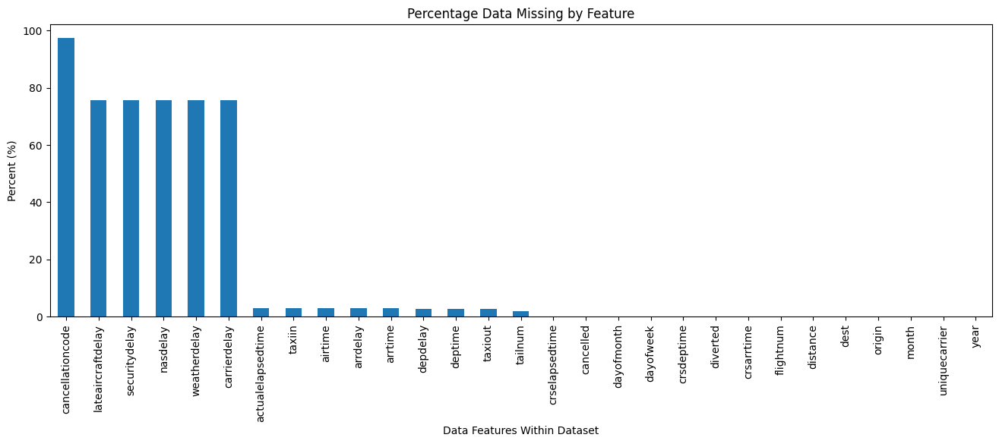

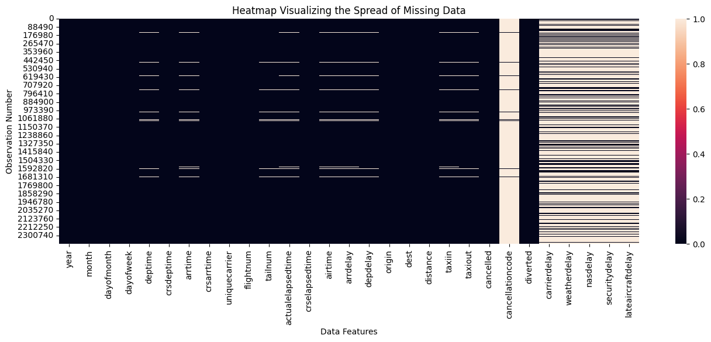  

Based on understanding each feature's purpose, many features could be dropped as they contained information that would not be available at the time a consumer or airline was trying to determine if their flight may incur a flight change (cancellation or diversion). 

The following features were deemed unimportant, as they would not be available at the time of prediction, and therefore should not contribute to predicting the outcome:
* `lateaircraftdelay`
* `securitydelay`
* `nasdelay`
* `weatherdelay`
* `carrierdelay`
* `cancellationcode`
* `depdelay`
* `arrdelay`
* `deptime`
* `actualelapsedtime`
* `arrtime`
* `airtime`
* `taxiin`
* `taxiout`

The following feature was also dropped as it contains a high number of unique category values:
* `tailnum`
    * According to an [Ashville Regional Airport article](https://flyavl.com/article/every-tail-tells-tale#:~:text=Every%20airplane%20has%20its%20own,is%20a%20paperwork%20intensive%20process.), `tailnum` is unique per aircraft currently in service. 
    * While less valuable to binarize (many unique values), it may be useful as a grouping feature to understand if a specific aircraft experiences more flight changes.
* `flightnum`
    * Will still be reviewed for relationship of individual flight plans being more prone to flight changes

The remaining missing values were feasibly and simply backfilled with zero (0) values.

#### 2.3.2 Statistical Understanding of Individual Features (Univariate Analysis)

When analyzing the common measures of central tendency (mean, median, mode) of the numerical features, their varying orders of magnitude would need to be addressed through scaling techniques to avoid disproportionate predictive impact when different models are tested for performance. Certain features seemed to also contain outliers, which would need to be accommodated to prevent skewing model performance.

 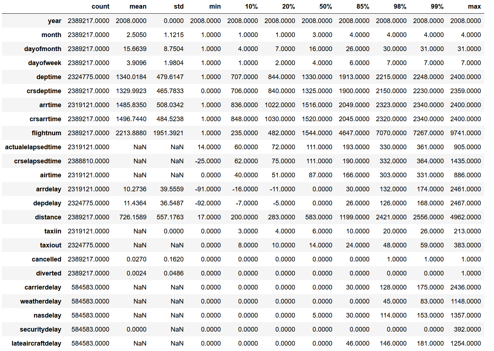

Regarding the categorical features, `uniquecarrier`, `origin`, and `dest` features were deemed important in determining what predictive power the airline carrier, origin airport, and destination airport (respectively) may contribute in predicting if a flight may be cancelled or diverted. Initially, each feature's unique values were reviewed by occurrence volumes to understand distribution of values within each set. 

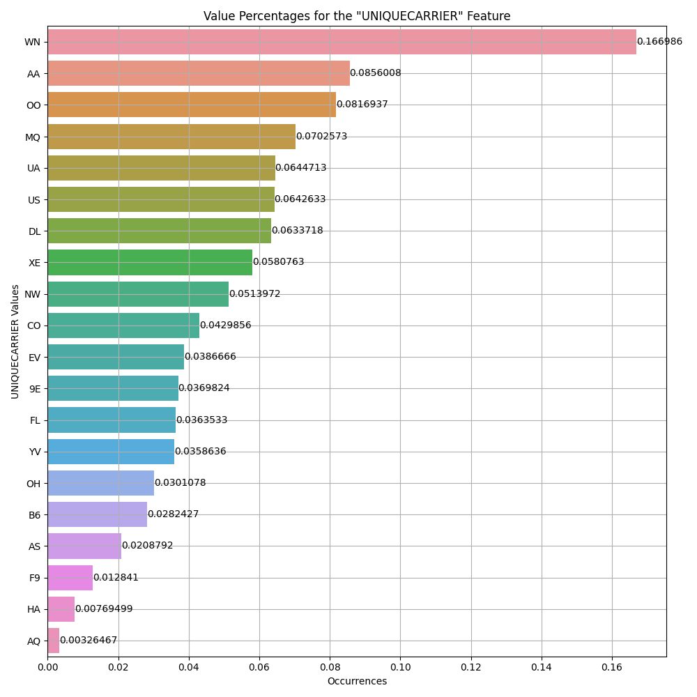

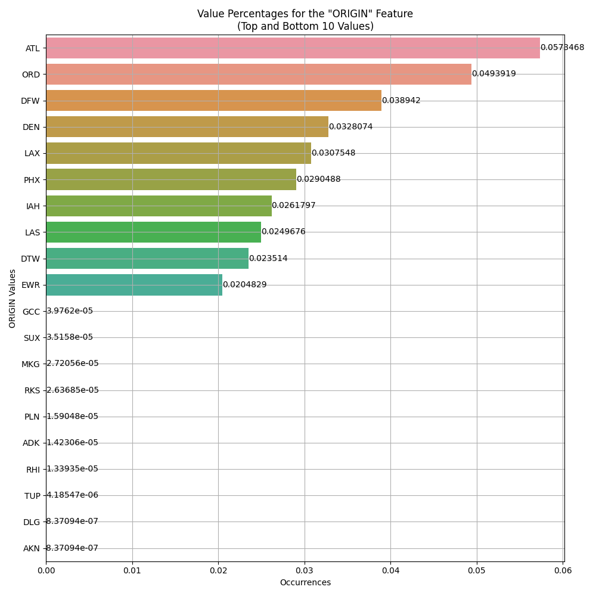

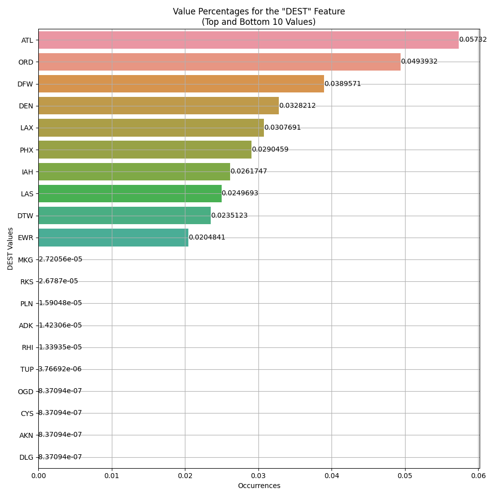

#### 2.3.3 Statistical Relationships Between Features (Bivariate Analysis)

Next the features were reviewed for correlation to determine if any feature pairs demonstrated high multicollinearity, which could negatively influence a model's performance and replicability. The following features were deemed unimportant to prevent multicollinearity issues.

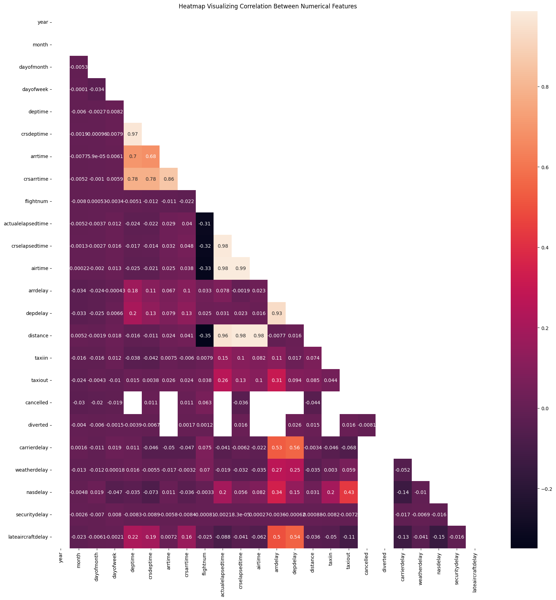

#### 2.3.4 Determining the Target Feature

Two different features individually indicate if a flight was diverted (`diverted`) or cancelled (`cancelled`). We'll engineer a new feature (`flight_outcome`) that more generally classifies that a flight did not complete on-schedule. Note, this classification does not currently consider completing the flight with delays, which may be a future ambition of this model. In generating this new feature, the two contributing features will then be removed since their value is now represented within the target feature's class set.

The new engineered target feature was then tested and analyzed against the data mining questions (1.3), to understand how `uniquecarrier`, `tailnum`, `flightnum`, `origin`, and `dest` feature values may relate to the `flight_outcome`. The results were interesting to surface which carriers, planes, flight plans, and origin/destination airports that demonstrated the highest volumes or percentages of cancelled/diverted flights. Though, the highest percentage values rarely corresponded with the highest volume values, making a broader modeled perspective more important to inform predictive power of each. (Reference notebook section 2.5)

<h2 style="text-align: center; border: 2px solid; padding: 25px 25px; color: red; font-weight: bold; font-style: italic;">3.0 Data Preparation</h2>

### 3.1 Implementing Insights from EDA

From the exploratory analysis, the following actions were performed on the dataset to prepare it for next feature engineering and class balancing steps:
* Creation of the new target feature, `flight_outcome`, which unified both `diverted` and `cancelled` features (which now can be removed).
* The above-mentioned features were removed, as they were disqualified as unimportant or would be unavailable at the time of prediction.
* Remaining missing values and duplicate records were removed, a small fraction of what was initially observed prior to deeper analysis.

### 3.2 Feature Engineering

As observed when reviewing their central tendency measurements, all remaining numerical features are scaled, to normalize their relative predictive impact on model performance.

In addition to creating the new target feature `flight_outcome`, as categorical features would limit modeling options, the following features are binarized to offer any value-level predictive power to model performance:
* `uniquecarrier`
* `origin`
* `dest`

### 3.3 Addressing Imbalanced Classes

Once the new target feature was created, it was quickly apparent only approximately 3% of all flights within the dataset where either diverted or cancelled.  This severe class imbalance was addressed by testing different class imbalance techniques, each resulting in shifting the class balance to 66.6%/33.3% (technical details in notebook, 3.5):
* Under-sampling 
* Over-sampling
* Synthetic data 

Each engineered dataset was then reviewed using a classifier model with a weighted loss applied, reflecting the new value breakdownm, from which the best performing model would be used to select the balancing technique.  

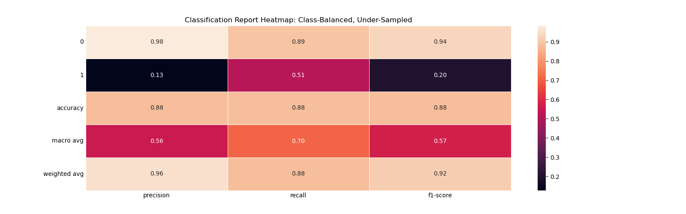

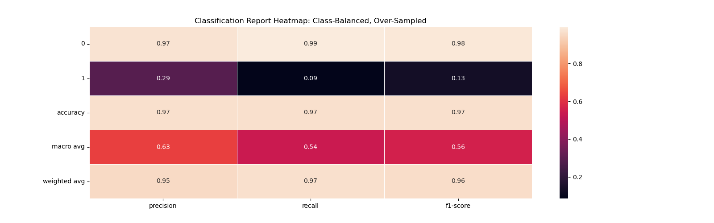

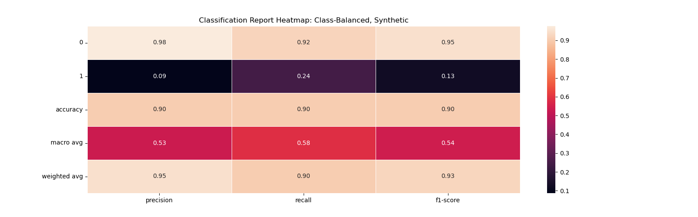

From reviewing the above classification reports of each model run, `precision` was deemed the most relevant scoring algorithm for the target feature, thus the over-sampling technique was selected to balance the training dataset, used for all models. 

Note: This was in conjunction with the above-mentioned binarization and scaling. 

<h2 style="text-align: center; border: 2px solid; padding: 25px 25px; color: red; font-weight: bold; font-style: italic;">4.0 Modeling and Improvements</h2>

The classification models being considered and tested are as follows:
* Dummy Classifier (baseline)
* Logistic Regression
* K-Nearest Neighbors
* Decision Tree
* Support Vector Machines
* RandomForest Decision Tree

To standardize evaluation, each would be measured on:
* Loss
* Scoring 

***Important Note:*** While most of the above-mentioned models yeilded reasonable results -- perhaps due to the computational limitations of my personal laptop -- the `K-Nearest Neighbors (KNN)` and `Support Vector Machines (SVM)` models did not conclude within any reasonable timeframes, and were removed for purposes of completing this exercise.

### 4.1 Baseline Models, Default Settings

As a starting point, a naive (dummy) model was created to establish a baseline, from which other more powerful models could improve identification of important features, as well demonstrate better prediction scores. 

Each classifier model was fit with it's respective default settings, except adding `class_weight = "balanced"`, to better accommodate the imbalanced classes within the target feature.

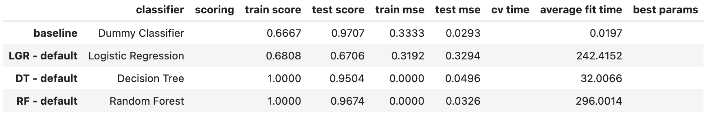

While the model scores did improve (potentially to the point of overfitting), it came at a computational cost (fit time). 

When considering each of the "default" classifer models, the ensemble classifiers (Decision Tree, Random Forest) both selected similar important features to quickly predict the target outcomes, whereas Logisitic Regression picked quite different features.

#### 4.1.1 Logistic Regression: Best Absolute Coefficients

The Logistic Regression model's feature selection from the dataset favored the binarized `origin` and `dest` values, where it deemed when specific airports were either the origination or destination point, it significantly impacted the target outcome of being either cancelled or diverted.

|    Features   |    Coef    |   Abs_Coef   |
|---------------|------------|--------------|
|   destination: IPL    |  -3.3672   |    3.3672    |
|   origin: RFD  |  -2.4724   |    2.4724    |
|   origin: MOT  |  -2.4282   |    2.4282    |
|   destination: ADK    |   2.3577   |    2.3577    |
|   origin: CDC  |  -2.3444   |    2.3444    |

#### 4.1.2 Decision Tree: Important Features

The Decision Tree evaluation determined that `dayofmonth` was most important as the first decision to take, followed in importance order indicated below. 

|             Feature             |  Importance  |
|---------------------------------|--------------|
| dayofmonth           |    0.1332    |
| flightnum            |    0.1282    |
| crsarrtime           |    0.0717    |
| distance             |    0.0713    |
| crsdeptime           |    0.0667    |

#### 4.1.3 Random Forest: Important Features

The Random Forest evaluation determined that `dayofmonth` was most important as the first decision to take, followed in importance order indicated below. 

|             Feature               |   Importance   |
|----------------------------------|-----------|
|  dayofmonth           |   0.1412  |
|  dayofweek            |   0.0901  |
|  flightnum            |   0.0878  |
|  crsarrtime           |   0.0785  |
|  crsdeptime           |   0.0750  |

### 4.2 Improving Model Perfomance

To improve robustness and replicability, each classifier model's hyperparameters were tested for different values and combinations with the goal of identifying the best parameters for each classifier, as well as understanding if hyperparameter tuning would identify a different classifier model as best performer.

The following hyperparameters will be tuned for their model, selecting the best parameters through a grid search cross-validation:
1. Logistic Regression
    * ***C:*** `[0.01, 0.1, 1, 10, 100]`
    * ***solver:*** `['liblinear', 'newton-cg', 'sag']`
2. Decision Trees
    * ***impurity_decrease:*** `[0.01, 0.02, 0.03, 0.05]`
    * ***max_depth:*** `[2, 5, 10]` (intentionally excludes value: `None`)
    * ***min_samples_split:*** `[0.1, 0.2, 0.05]`
3. Random Forest
    * ***n_estimators:*** `[50, 100, 200]`
    * ***max_depth:*** `[2, 5, 10]` (intentionally excludes value: `None`)
    * ***min_samples_split:*** `[0.1, 0.2, 0.05]`
    * ***criterion:*** `['gini', 'entropy']`

Interestingly, while the expectation for each model was to improve it's predictive score, it was observed that:
* Logistic Regression scoring remained fairly the same as when it's default settings (and solver) where modeled. This may indicate that the "class_weight" parameter was the most impactful, where modfications to other parameters did not materially impact it's default performance.
* Decision Tree scoring significantly reduced while optimizing it's hyperparameters, indicating either that lesser impact hyperparameters were tested within the grid search, or their values were not sufficiently characteristic. 
* Random Forest scoring was also much lower than it's "default" measurements, though it was still comparable in score and loss function with either Logisitic Regression model (default or improved). 

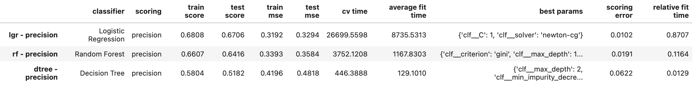

### 4.3 Selecting the Best Model

From a scoring and loss/error measurement, the Logistic Regression model demonstrated the best performance as compared to the "improved" Decision Tree and Random Forest performances.  It's accepted that the "default" performance of both ensemble methods recorded much higher, but its very likely those models were overfit and would result in poor prediction with future unseen data.

With both Logistic Regression and Random Forest improved models scoring comparably, it's worth reviewing other modeling characteristics, such as the model fit time. To produce comparable predictions, the Random Forest model required a fraction of time to fit the dataset, making it the favorable model for this exercise. 

***Best Model:*** "Improved" Random Forest
* comparable prediction power
* lower fit timing

<h2 style="text-align: center; border: 2px solid; padding: 25px 25px; color: red; font-weight: bold; font-style: italic;">5.0 Findings and Next Steps</h2>

### 5.1 Findings

Determining if an uncommon occurrence (e.g. a flight in the future may be cancelled or diverted) can be accurately and reliably turns out to be quite a daunting task. While the attempts to model and predict this occurrence were somewhat successful, much more work may be required to continue to explore other means to improve their precision.  

That said, there seems to be a strong correlation to the day of the month, as well as the day of the week the flight is chosen. 

Another influential factor is the specific airport the flight either originates from or lands at. Some airports may have greater issue with managing traffic control, which may cause some of these flight changes. These combinations of origin and destination airports may also tie back to the flight itself (flight number).

The times a flight is scheduled to arrive and depart also influence the likelyhood of flight diversion or cancellation.

### 5.2 Next Steps and Recommendations
* Consider expanding the target feature to include multiple classes, including separation of "cancelled" and "diverted" outcomes for more specificity, and adding a "delayed" class for when flights complete, just not on schedule.
* Consider expanding the hyperparameters to test in combination through grid search for each classifier, to understand if other parameters may have more meaningful impact to it's scoring.
* Consider running the modeling steps on a more robust computing environment to reduce complexity of modeling and grid searching.